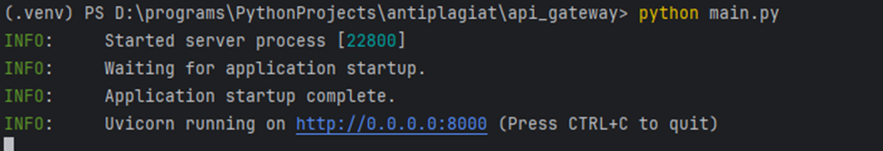

# Документация к системе антиплагиата

## Описание

Система предназначена для анализа студенческих работ на предмет плагиата. Основные возможности:

- Подсчёт статистики (количество абзацев, слов, символов)

- Сравнение файлов на схожесть

- Генерация облака слов (визуализация)

## Архитектура 

```
┌─────────────┐     ┌──────────────┐      ┌───────────────┐
│ API Gateway │ ◄──►│ File Storage │ ◄──► │ File Analysis │
└─────────────┘     └──────────────┘      └───────────────┘
       ▲
       │
       ▼
┌─────────────┐
│   Клиент    │
└─────────────┘
```

## Описание компонентов

### 1. API Gateway (порт 8000)

- Единственная точка входа для клиентов

- Маршрутизация запросов к сервисам

### 2. File Storage Service (порт 8001)

- Хранение загруженных файлов (.txt)

- Управление данными файлов

### 3. File Analysis Service (порт 8002)

- Анализ текстов

- Сравнение файлов

- Генерация статистики

## Запуск

1. Установка зависимостей

```bash
python -m venv .venv
.\.venv\Scripts\activate
pip install -r requirements.txt
```

2. Запуск сервисов в разных терминалах

```bash
# File Storage Service
cd file_storing
python main.py

# File Analysis Service
cd ../file_analysis
python main.py

# API Gateway
cd ../api_gateway
python main.py
```



## Спецификация API

### API Gateway (http://localhost:8000)

1. Загрузка файлов
```
POST /upload
Content-Type: multipart/form-data

Параметры:
- file: текстовый файл (.txt)

Ответ:
{
  "id": int,       # ID файла
  "filename": str   # Имя файла
}
```
2. Анализ файлов
```POST /analyze
Content-Type: application/json

Тело запроса:
{
  "file_id": int,          # ID анализируемого файла
  "compare_with": [int]    # Список ID для сравнения
}

Ответ:
{
  "analysis_id": int  # ID анализа
}
```
3. Получение результатов по id сравниваемого файла
```
GET /results/{file_id}
Ответ:
{
  "file_id": int,
  "stats": {
    "paragraphs": int,
    "words": int,
    "characters": int
  },
  "similarity": {
    "file_id": float  # Процент схожести
  }
}
```
## Тестирование

Запуск тестов с проверкой покрытия
```bash
pytest --cov --cov-report=html
```


## Пример работы с помощью Swagger
### Порт API gateway
1. Загрузка нескольких файлов


2. Анализ файла


3. Получение результата анализа по id файла


### В swagger file_storing доступна возможность загрузки файла по его id


## Примеры баз данных
### file_storage.db


### file_analysis.db

