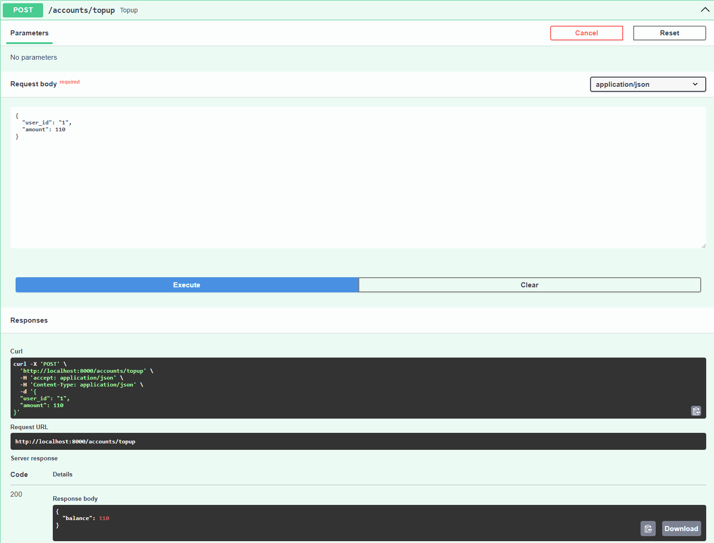
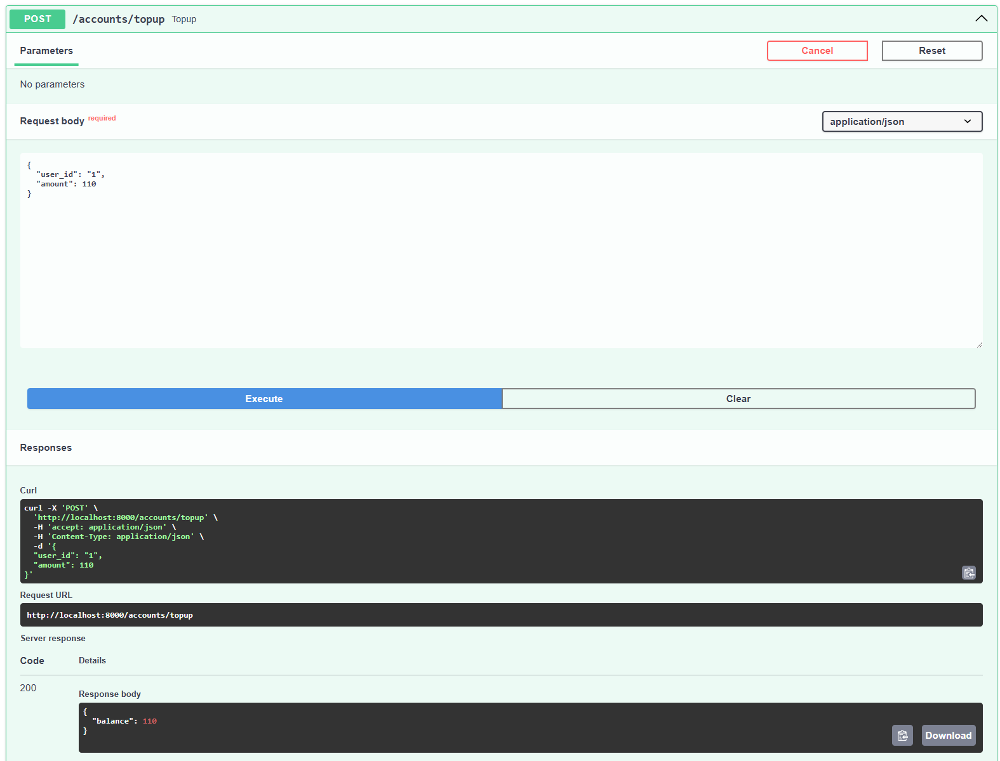
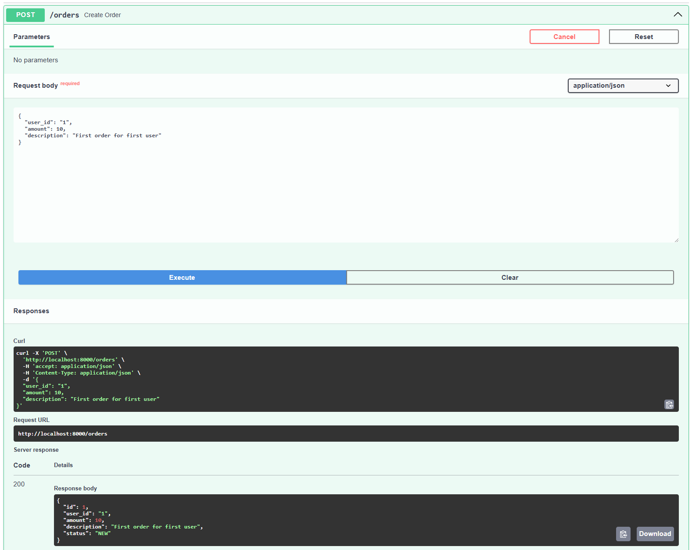
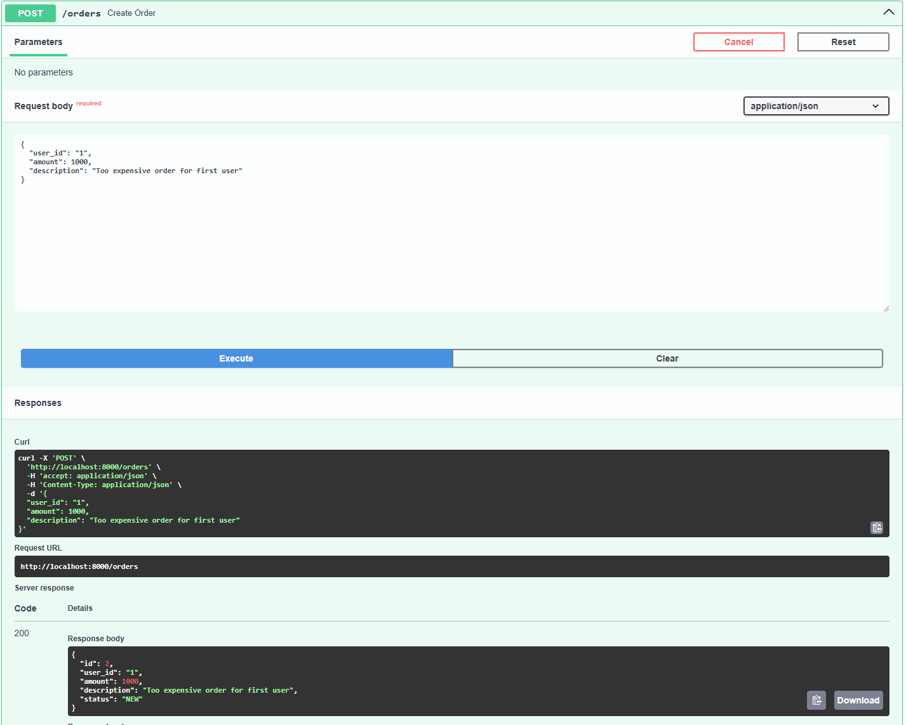
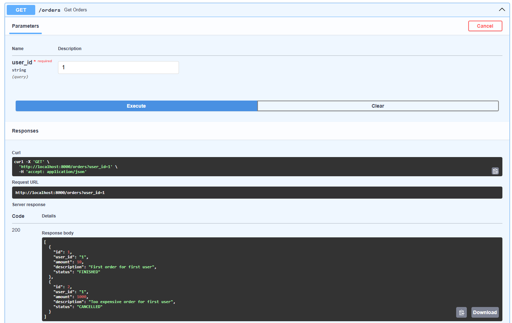
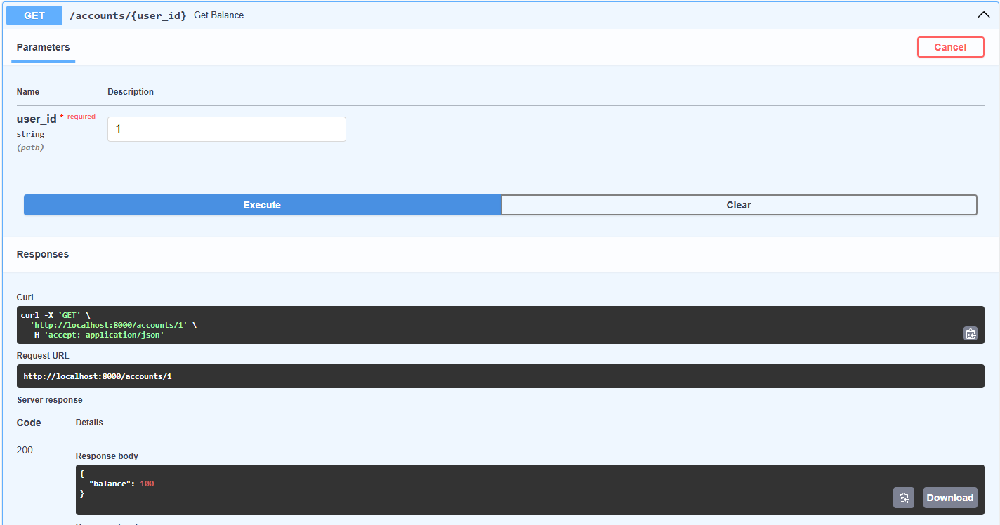

## Отчёт по проекту
### Мушкат Илья Валерьевич БПИ238

### 1. Общая архитектура и разделение на сервисы

Проект реализован в виде двух микросервисов:

- Order Service — сервис, управляющий заказами. Создаёт и хранит заказы, публикует задачи оплаты в очередь сообщений.


- Payments Service — сервис, отвечающий за обработку оплат пользователей. Получает задачи из очереди, проводит списание средств и публикует результаты.

Каждый сервис имеет собственную базу данных Postgres.

### 2. Использование очередей сообщений (Kafka)
#### Для обмена информацией между сервисами используется очередь сообщений Kafka:

- Order Service публикует события оплаты заказов в топик payment_tasks.


- Payments Service потребляет события из payment_tasks, обрабатывает оплату и публикует результат в топик payment_results.


- Order Service подписан на топик payment_results, чтобы обновлять статус заказа по результатам оплаты.


- Использование Kafka даёт асинхронность, надёжность и масштабируемость взаимодействия между сервисами.

### 3. Применение паттернов транзакционной обработки сообщений
#### 3.1 Transactional Outbox в Order Service
- В Order Service реализован паттерн Transactional Outbox:


- При создании/обновлении заказа в базе данных одновременно записывается событие в таблицу outbox_orders — "коробка исходящих сообщений".


- Отдельный воркер периодически считывает из таблицы outbox_orders необработанные записи и отправляет их в Kafka.


- После успешной отправки сообщение помечается как обработанное (processed = True).


- Таким образом гарантируется, что запись в базу данных и публикация сообщения в очередь происходят атомарно — либо оба успешно, либо нет.

#### 3.2 Transactional Inbox и Outbox в Payments Service
В Payments Service реализованы оба паттерна:

- Transactional Inbox: При получении сообщения о задаче оплаты из Kafka, сервис сохраняет событие в локальную таблицу inbox_payments, отмечая, что оно получено и обрабатывается.


- Обработка происходит с использованием этой таблицы, что предотвращает повторную обработку одних и тех же сообщений (идемпотентность).


- После успешной обработки создаётся запись в таблице outbox_payments с результатом операции.


- Отдельный воркер отправляет исходящие события из outbox_payments в Kafka в топик payment_results.


- Так обеспечивается устойчивость и согласованность обработки с гарантией, что каждое событие будет обработано ровно один раз.

### 4. Обеспечение семантики exactly-once при списании денег


#### Для платежей реализованы следующие меры:

- При получении сообщения Payment Service сохраняет событие в Inbox. Если событие уже обработано (идентификатор уникален), оно пропускается — что предотвращает дублирование.


- При списании средств проверяется состояние заказа и пользователя в базе — списание производится только один раз.


- Результат успешного или неуспешного списания помещается в Outbox, который потом передаётся в Kafka.


- Order Service, получая подтверждение, обновляет статус заказа.


- Таким образом достигается семантика exactly once — каждое списание денег выполняется ровно один раз, без дублирования или пропусков.

### 5. Технические детали реализации
#### Docker Compose организует сервисы, базы данных и Kafka с Zookeeper.

- В docker-compose.yml настроены зависимости запуска, обеспечивающие корректный порядок запуска: сначала базы данных, затем Kafka, после — микросервисы.


- Каждый сервис написан на Python с использованием SQLAlchemy для работы с БД и kafka-python для взаимодействия с Kafka.


- Асинхронная обработка сообщений реализована через отдельные потоки в сервисах.


- Логирование и обработка ошибок обеспечивают стабильную работу и удобство отладки.

### 6. Комментарии к запуску

#### Весь проект собирается и запускается командой

```
docker-compose up --build
```

Чтобы при запуске не возникало проблемы с тем, что бд не успевают подняться до запуска модулей
были добавлены таймауты до запуска в оба worker.py. Почему-то healthcheck с Kafka не получилось настроить :(
```python
time.sleep(5)
```
Swagger документация после запуска доступна на
```
http://localhost:8000/docs
```

### 7. Пример работы сервиса 
#### Создание аккаунта


#### Пополнение баланса аккаунта



#### Создание заказов





#### Проверка статусов заказов



#### Проверка баланса пользователя после обработки заказов

